# Compose Playground


🌐 **Live site: https://corvidlabs.github.io/compose-playground/**

- **Docs site:** an [Astro](https://astro.build)-powered browsable catalog (source in [`site/`](site/)) — see [`site/README.md`](site/README.md).

An interactive **Jetpack Compose + Material 3** gallery: **52 components** across **11
groups**, each with its own detail page, a written description, related links, and
scrollable examples that pair a **live, interactive demo** with its **expandable source
code**. Browse by group or search across everything.

> **📸 [Browse the full visual gallery → `docs/COMPONENTS.md`](docs/COMPONENTS.md)** — every one of
> the 52 components, rendered as a screenshot. No emulator required.
>
> All screenshots are generated deterministically by the snapshot tests (Paparazzi) — the real
> UI, rendered on the JVM with no device.

## Screens

| Home (light) | Home (dark) |
|:---:|:---:|
| 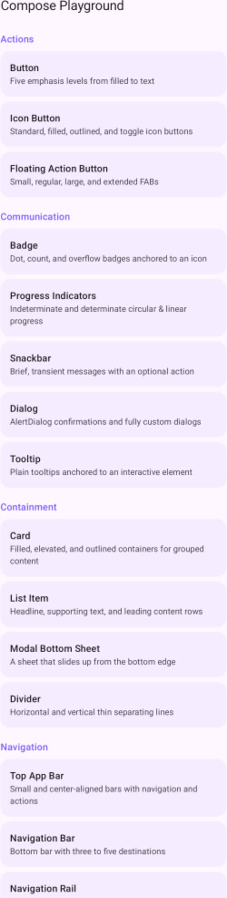 | 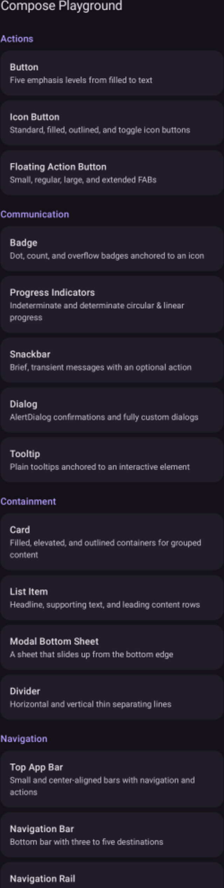 |

A few component detail pages — see **[the full gallery](docs/COMPONENTS.md)** for all 52:

| Button | Chip | Text Field | Date & Time Pickers |
|:---:|:---:|:---:|:---:|
| 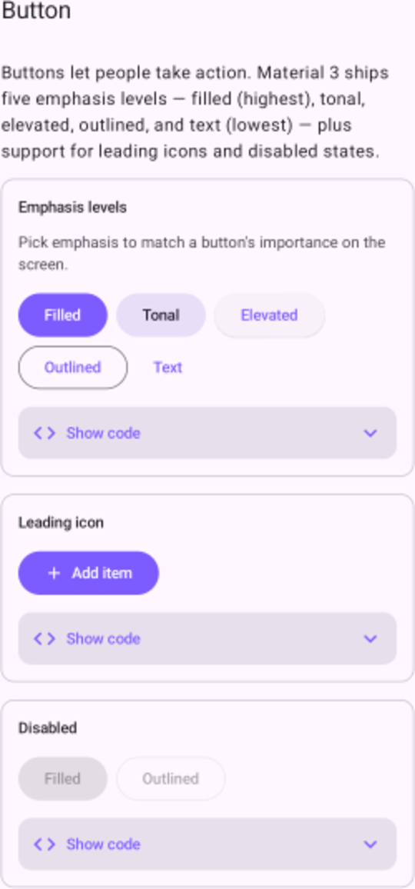 | 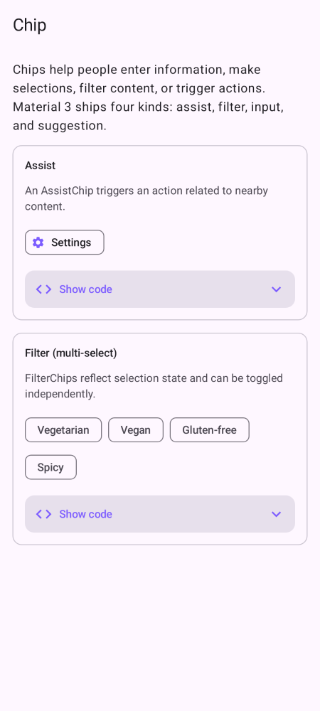 | 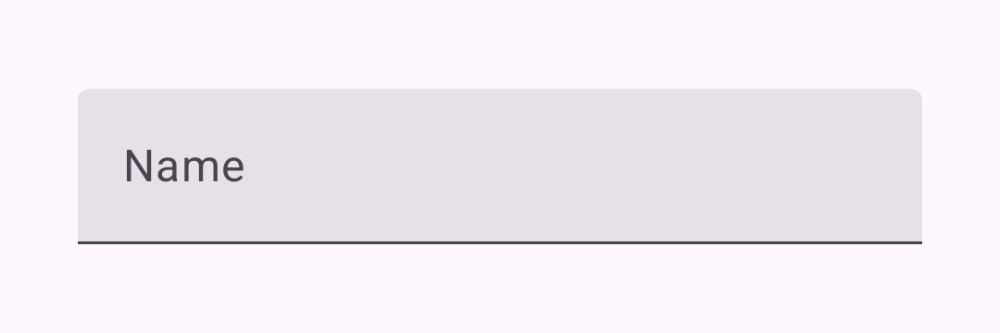 | 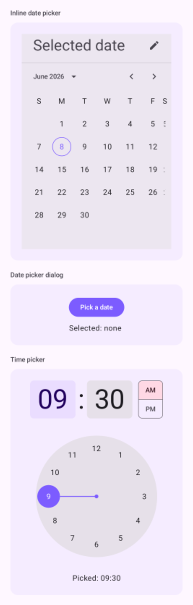 |

| Slider | Navigation Bar | Lazy Grid | Pager |
|:---:|:---:|:---:|:---:|
| 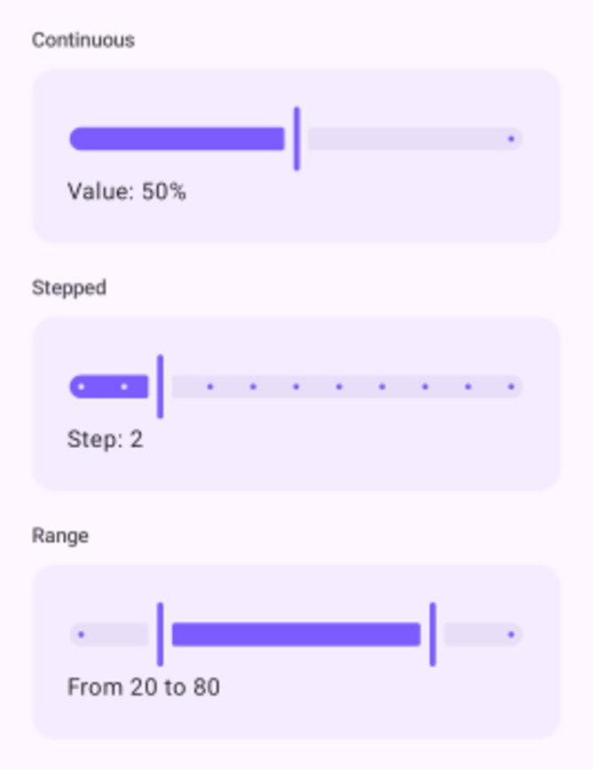 | 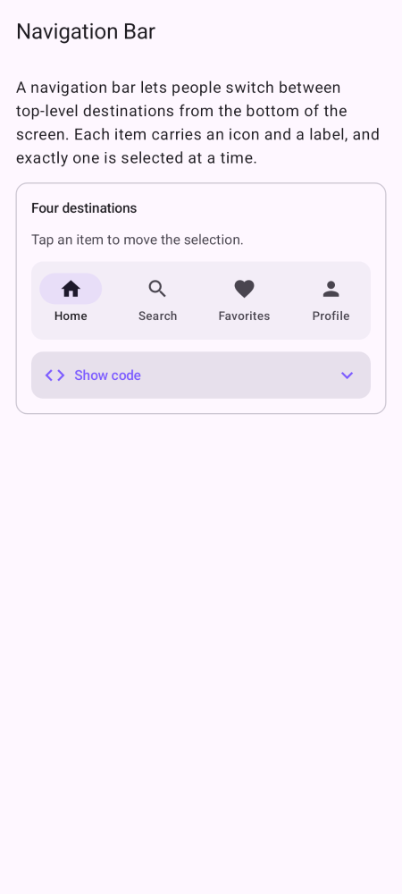 | 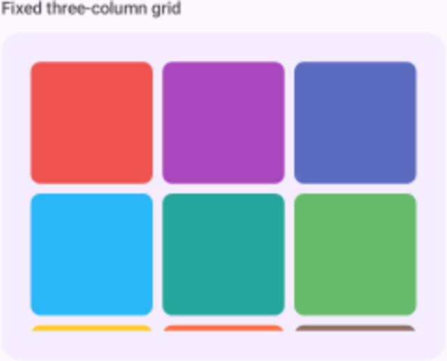 | 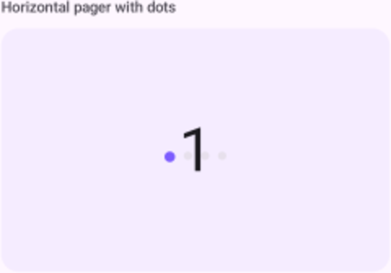 |

| Canvas | Gradients | Gradients (dark) | Card (dark) |
|:---:|:---:|:---:|:---:|
| 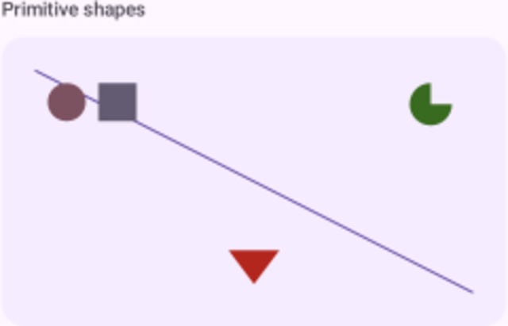 | 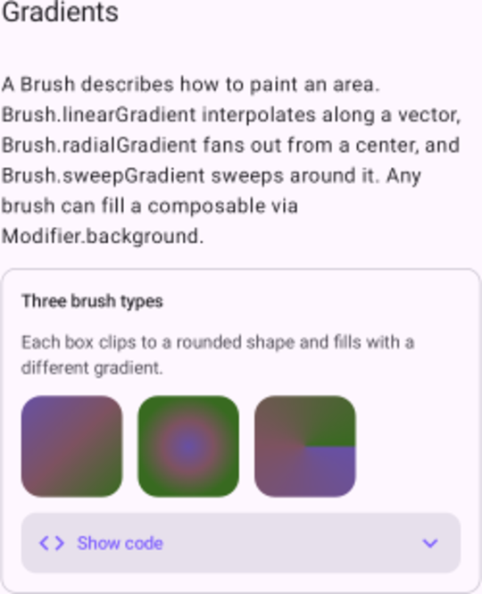 | 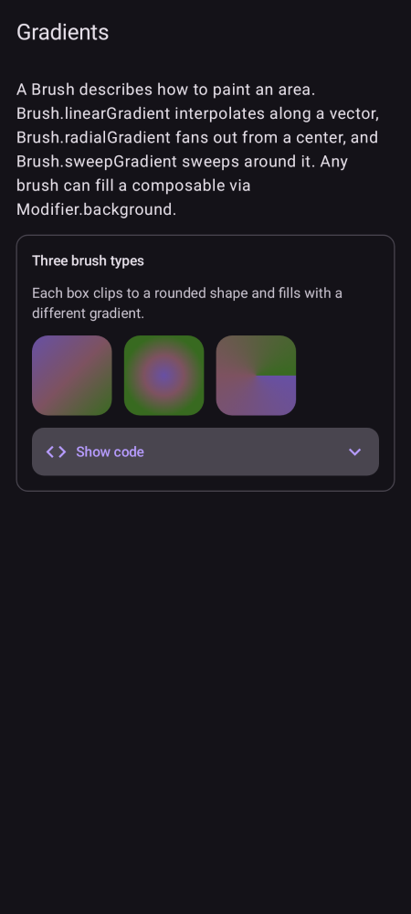 | 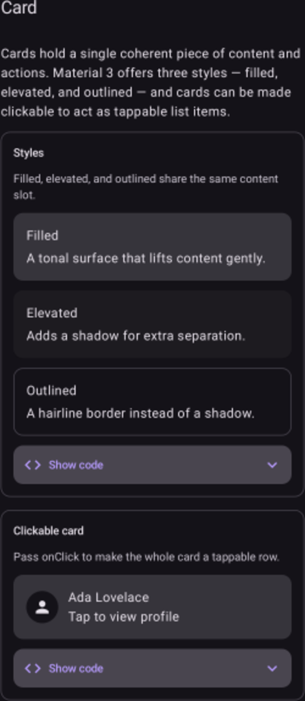 |

## Stack

| | |
|---|---|
| Language | Kotlin 2.0.21 |
| UI | Jetpack Compose + Material 3 |
| Navigation | Navigation Compose |
| Snapshots | Paparazzi (JVM, no device) |
| Build | AGP 8.7.3 / Gradle 8.9 |
| SDK | compileSdk 35 · minSdk 24 |
| Tasks/CI | fledge · spec-sync · GitHub Actions (Ubuntu + self-hosted macOS) |

## Component catalog

### Actions (3)
Button, Floating Action Button, Icon Button

### Communication (5)
Badge, Dialog, Progress Indicators, Snackbar, Tooltip

### Containment (4)
Card, Divider, List Item, Modal Bottom Sheet

### Navigation (7)
Bottom App Bar, Menu, Navigation Bar, Navigation Drawer, Navigation Rail, Tabs, Top App Bar

### Selection & Inputs (7)
Checkbox, Chip, Date & Time Pickers, Radio Button, Segmented Button, Slider, Switch

### Text & Fields (2)
Text & Typography, Text Field

### Layout (4)
Box, Row & Column, Spacer, Surface

### Lists & Grids (5)
Lazy Column, Lazy Grid, Lazy Row, Pager, Staggered Grid

### Animation (5)
`animate*AsState`, AnimatedContent, AnimatedVisibility, Crossfade, InfiniteTransition

### Gestures & Scroll (6)
Clickable, Draggable, Pull to Refresh, Scroll, Swipe to Dismiss, Transformable

### Graphics & Drawing (4)
Canvas, Draw Modifiers, Gradients, Shapes & Clipping

## Architecture

```
app/src/main/java/com/corvidlabs/composeplayground/
├── MainActivity.kt          # entry point, applies the theme
├── PlaygroundApp.kt         # NavHost: grouped + searchable home, component/{id} detail
├── model/Component.kt       # Component / CodeExample / ComponentGroup model
├── catalog/
│   ├── Registry.kt          # aggregates every group → allComponents, componentsByGroup
│   └── groups/*.kt          # one file per group (Actions, Communication, … Graphics)
└── ui/
    ├── theme/               # Material 3 theme (+ Material You dynamic color)
    └── components/          # CodeBlock (collapsible source) + ExampleCard
```

Each component is a `Component(id, name, group, summary, description, related, examples)`,
and each `CodeExample` is a live `@Composable` demo plus the source string shown beneath it.

**Add a component** in two steps: append a `Component(...)` to the relevant
`catalog/groups/<Group>.kt`, then it appears automatically — `Registry.kt` aggregates the
per-group lists, so there is no central file to edit.

## Accessibility

Icons carry meaningful `contentDescription`s (or `null` when decorative) and section
headers expose heading semantics for TalkBack. See **[docs/ACCESSIBILITY.md](docs/ACCESSIBILITY.md)**
for the full audit and conventions.

## Build & run

```bash
./gradlew assembleDebug      # build the debug APK
./gradlew installDebug       # install on a connected device/emulator (API 24+)
```

Open in Android Studio and run the `app` configuration. (Java comes from the Android Studio
JBR; the fledge tasks below set `JAVA_HOME` for you.)

## Snapshot tests

Snapshots are rendered on the JVM with **Paparazzi** — no emulator, fully deterministic, and
the golden PNGs double as the screenshots above.

```bash
./gradlew recordPaparazziDebug   # regenerate golden images (app/src/test/snapshots/images)
./gradlew verifyPaparazziDebug   # assert the UI matches the goldens (runs in CI)
```

Goldens live in `app/src/test/snapshots/images/`; a curated subset is mirrored to
`docs/screenshots/` for this README. After an intentional UI change, re-run `record`,
review the diff, and commit.

## fledge tasks

This repo ships a [`fledge.toml`](fledge.toml). List and run tasks:

```bash
fledge run --list
fledge run build           # ./gradlew assembleDebug (JBR auto-selected)
fledge run test            # unit tests
fledge run snapshot-verify # Paparazzi verification
fledge run spec-check      # spec-sync validation
fledge run ci              # the full CI lane
```

Specs live under `specs/` and are validated with **spec-sync** (`fledge spec check`).

## Continuous integration

- **Ubuntu** ([`.github/workflows/ci.yml`](.github/workflows/ci.yml)) — builds the debug APK
  on every push/PR and uploads it as an artifact.
- **Self-hosted macOS** ([`.github/workflows/macos-selfhosted.yml`](.github/workflows/macos-selfhosted.yml)) —
  runs the full `fledge run ci` lane (build → tests + spec check → snapshot verification) on a
  Mac runner that has the Android SDK, the JBR, and fledge. Register the runner once with
  [`scripts/setup-macos-runner.sh`](scripts/setup-macos-runner.sh), then `./run.sh`.
