# Component Gallery

Every one of the **52 components** in the playground, rendered as its detail screen. These are the deterministic Paparazzi snapshots — the real UI, no emulator needed. Each in-app screen also lets you expand the source for every example.

Jump to a group: [Actions](#actions) · [Communication](#communication) · [Containment](#containment) · [Navigation](#navigation) · [Selection & Inputs](#selection--inputs) · [Text & Fields](#text--fields) · [Layout](#layout) · [Lists & Grids](#lists--grids) · [Animation](#animation) · [Gestures & Scroll](#gestures--scroll) · [Graphics & Drawing](#graphics--drawing)

## Actions

### Button

Buttons let people take action. Material 3 ships five emphasis levels — filled (highest), tonal, elevated, outlined, and text (lowest) — plus support for leading icons and disabled states.

### Floating Action Button

The FAB represents the primary action of a screen. It comes in small, regular, and large sizes, plus an extended form that pairs an icon with a label.

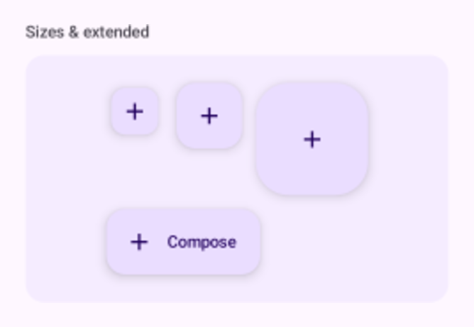

### Icon Button

Icon buttons trigger a single action with a compact, recognizable glyph. They come in standard, filled, and outlined styles, plus a toggleable variant.

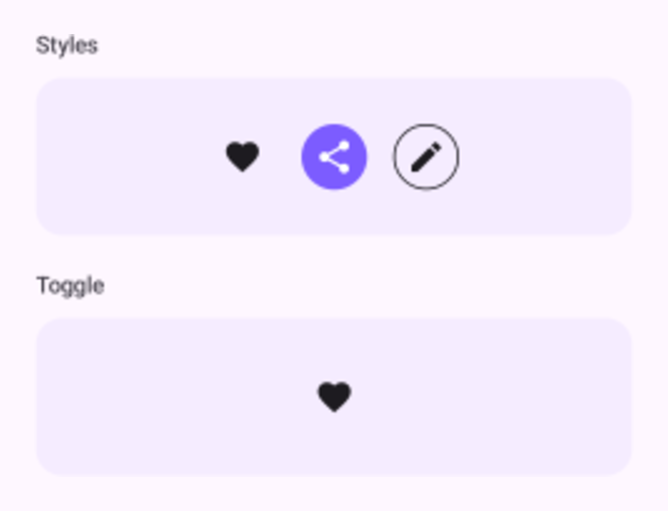

## Communication

### Badge

A Badge draws attention to a small piece of dynamic status — an unread count or a simple dot — on top of another element. Wrap an anchor in a BadgedBox and supply the badge; an empty Badge renders as a dot, while content renders as a label.

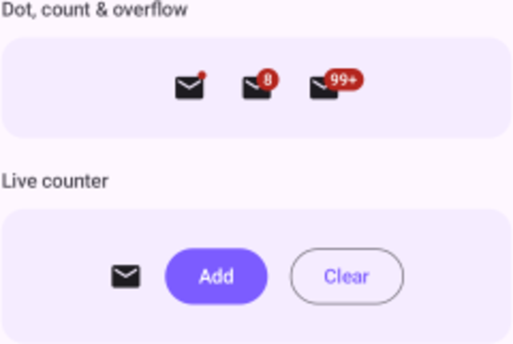

### Dialog

Dialogs interrupt to request a decision or show critical information. AlertDialog gives you a ready-made layout with icon, title, body, and confirm/dismiss buttons, while the lower-level Dialog lets you place any content — such as a Card — in a modal window.

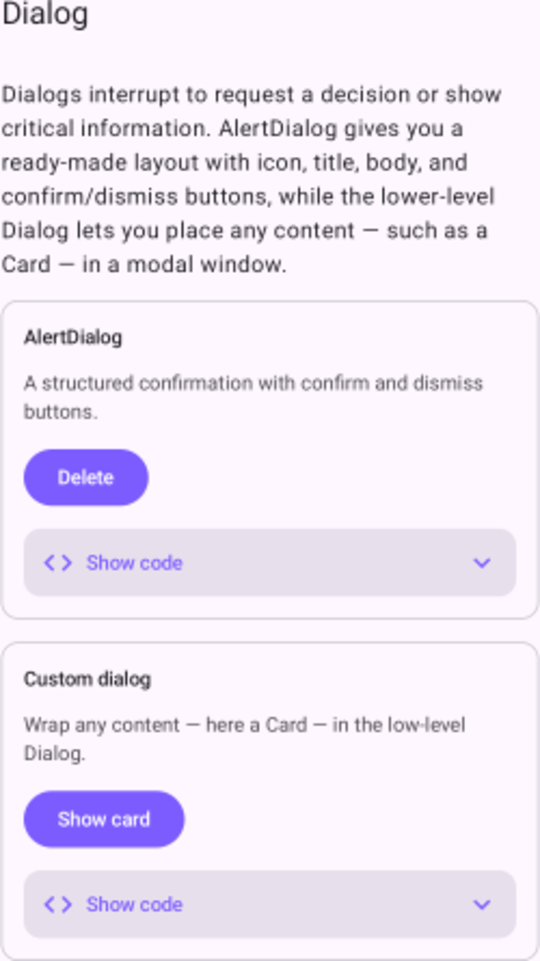

### Progress Indicators

Progress indicators express an unspecified wait time (indeterminate) or how far along a known operation is (determinate). Both circular and linear variants are available; pass a progress lambda for the determinate form.

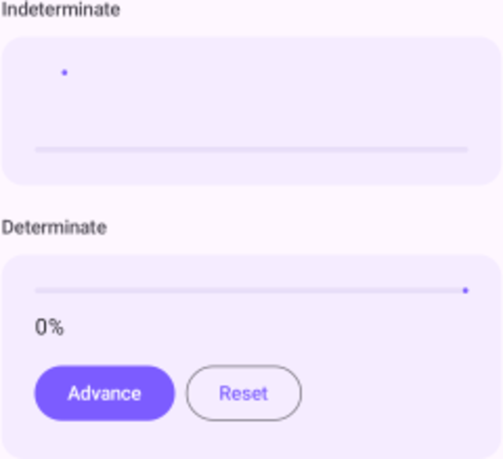

### Snackbar

A Snackbar shows a short, low-priority message at the bottom of the screen. Host it with a SnackbarHost bound to a SnackbarHostState, then call showSnackbar from a coroutine. An action label lets people respond, and the returned result tells you whether they tapped it.

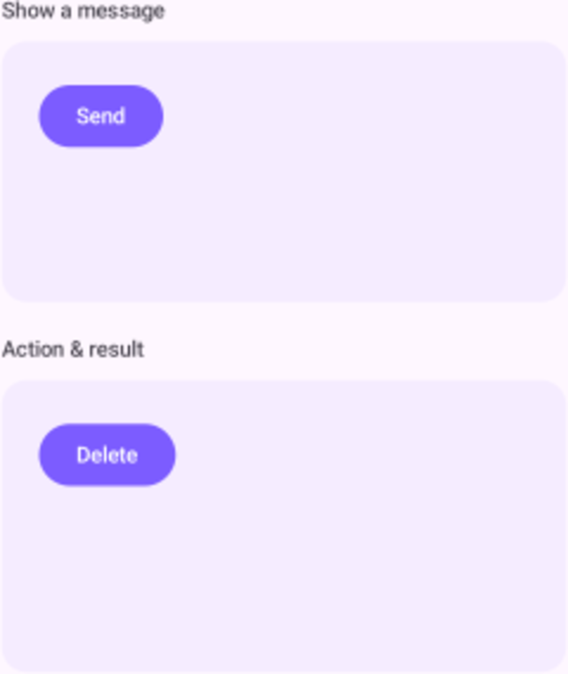

### Tooltip

Tooltips reveal a brief label for an element on long-press or hover. A TooltipBox positions a PlainTooltip relative to its anchor and is driven by a TooltipState that controls when the tooltip appears.

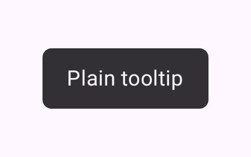

## Containment

### Card

Cards hold a single coherent piece of content and actions. Material 3 offers three styles — filled, elevated, and outlined — and cards can be made clickable to act as tappable list items.

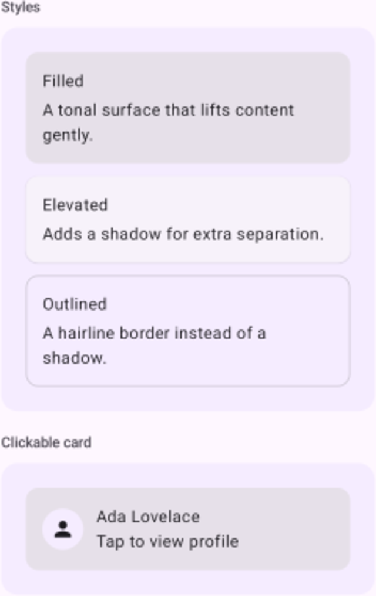

### Divider

Dividers are thin lines that group content into sections. Use a HorizontalDivider between stacked items and a VerticalDivider inside a fixed-height row to separate side-by-side content.

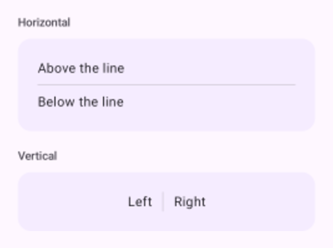

### List Item

ListItem renders a single Material 3 list row with slots for headline, supporting text, and leading or trailing content. Wrap a column of them in a tonal Surface and separate them with dividers to build a settings-style list.

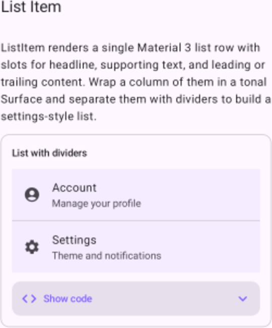

### Modal Bottom Sheet

A modal bottom sheet presents a focused set of actions anchored to the bottom of the screen, dimming the content behind it. Drive it with rememberModalBottomSheetState and hide it before clearing the open flag for a smooth exit animation.

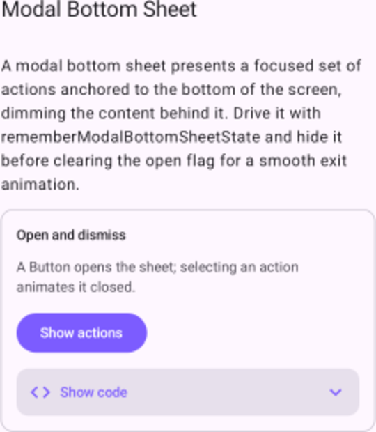

## Navigation

### Bottom App Bar

A bottom app bar groups a small set of action icons at the bottom of the screen and commonly hosts a floating action button for the screen's primary action.

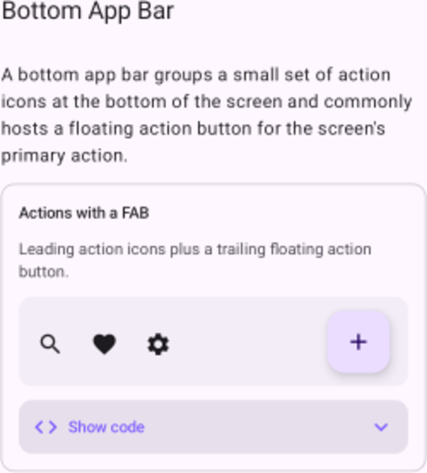

### Menu

Menus display a list of choices on a temporary surface. A DropdownMenu anchors to a trigger such as a button, while an ExposedDropdownMenuBox pairs a text field with a menu so people can pick a value.

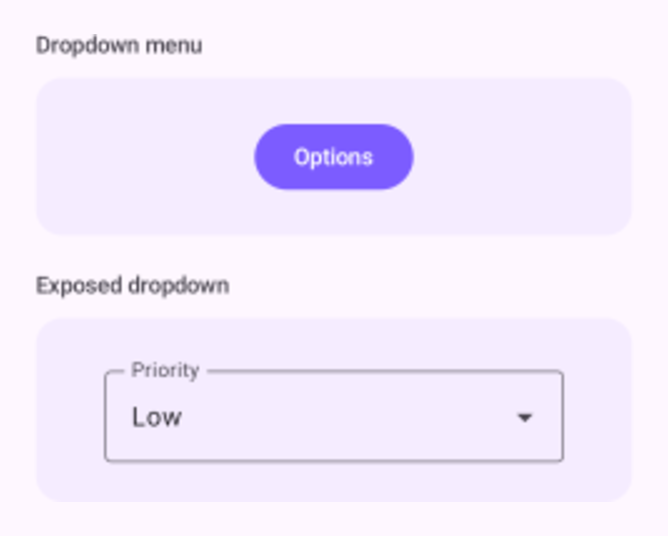

### Navigation Bar

A navigation bar lets people switch between top-level destinations from the bottom of the screen. Each item carries an icon and a label, and exactly one is selected at a time.

### Navigation Drawer

A navigation drawer presents destinations in a vertical sheet that usually slides in from the side. Shown here is the drawer sheet content on its own — a column of NavigationDrawerItem entries — without the full sliding overlay.

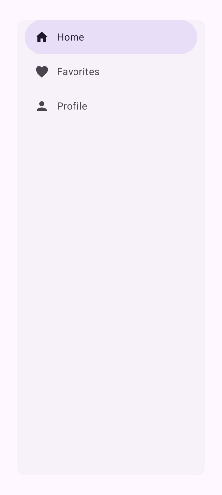

### Navigation Rail

A navigation rail places top-level destinations along the side of the screen, a common pattern on tablets and other large displays. Like the navigation bar, exactly one destination is selected at a time.

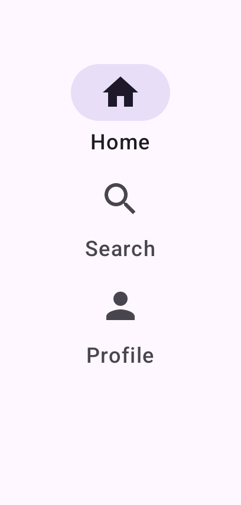

### Tabs

Tabs organize content across parallel sections of a screen. A fixed TabRow splits the available width evenly, while a ScrollableTabRow keeps each tab at its natural width and scrolls horizontally when they overflow.

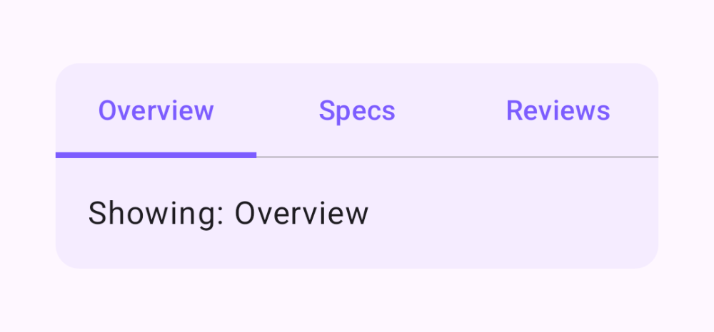

### Top App Bar

Top app bars display a screen title plus a leading navigation icon and trailing action icons. Material 3 ships small, center-aligned, medium, and large variants; the small and center-aligned forms are shown here.

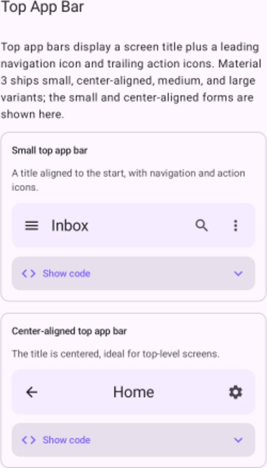

## Selection & Inputs

### Checkbox

Checkboxes let people select one or more items from a set, or turn a single option on or off. A TriStateCheckbox can act as a parent that reflects and toggles a group of child checkboxes.

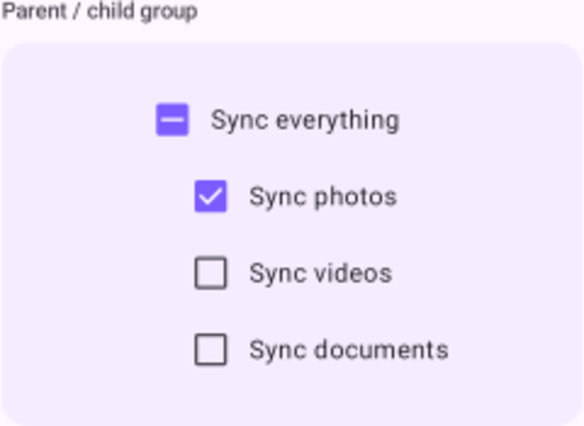

### Chip

Chips help people enter information, make selections, filter content, or trigger actions. Material 3 ships four kinds: assist, filter, input, and suggestion.

### Date & Time Pickers

Pickers let people choose a date or time. Material 3 provides an inline DatePicker, a DatePickerDialog for modal selection, and a TimePicker with a clock face.

### Radio Button

Radio buttons let people select a single option from a mutually exclusive set. Wrap each row in Modifier.selectable so the whole row is tappable and accessible.

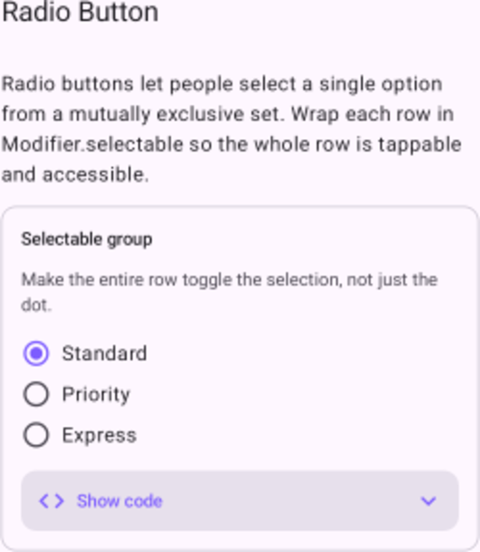

### Segmented Button

Segmented buttons group related options in a compact toggle. Use single choice for mutually exclusive options and multi choice for independent toggles.

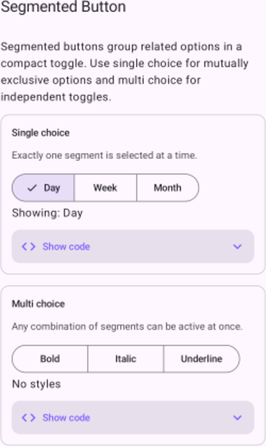

### Slider

Sliders let people select a value or range from along a track. They support continuous motion, discrete steps within a range, and a two-thumb range variant.

### Switch

Switches toggle the state of a single item on or off. They are the preferred control for settings rows where the change takes effect immediately.

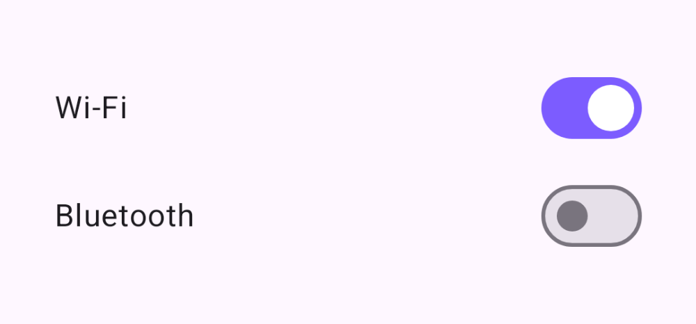

## Text & Fields

### Text & Typography

Text renders strings using the Material 3 type scale. It supports rich, inline styling via AnnotatedString, truncation with TextOverflow, and user text selection through SelectionContainer.

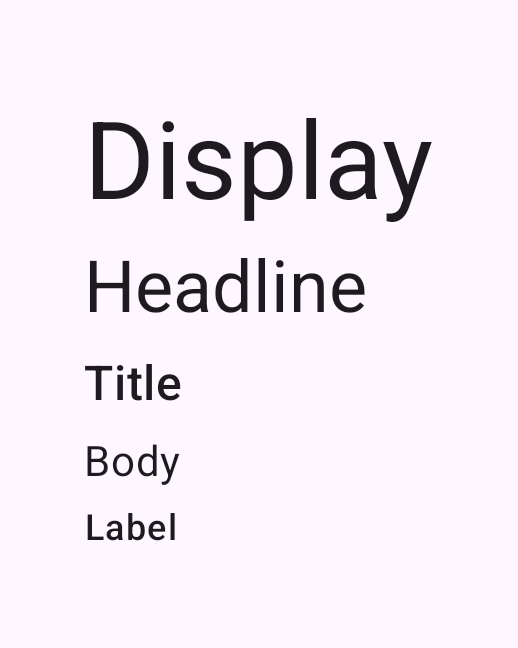

### Text Field

Text fields let people enter and edit text. Material 3 offers filled and outlined styles with labels, placeholders, supporting text, error states, leading and trailing icons, keyboard options, and visual transformations.

## Layout

### Box

Box draws its children on top of one another, sized to the largest. Each child positions itself within the Box using Modifier.align, making it ideal for overlays, badges, and corner-anchored content.

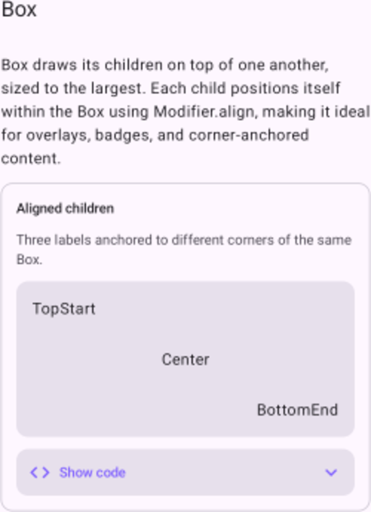

### Row & Column

Row and Column are the workhorse layouts. Children are placed along the main axis; weight distributes leftover space proportionally, and arrangement controls the gaps between and around them.

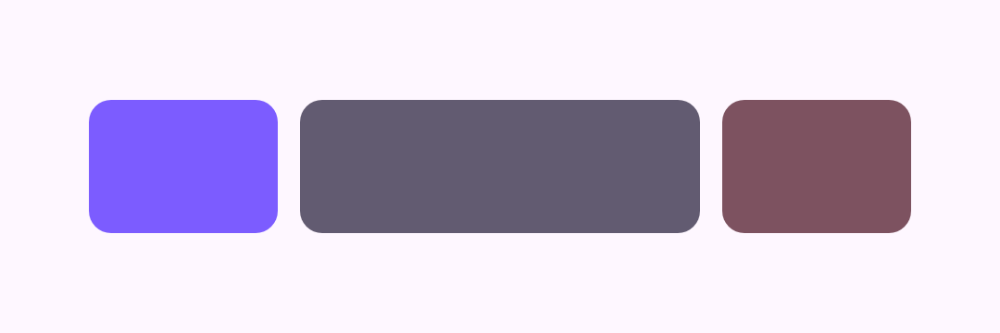

### Spacer

Spacer is an empty layout used to insert gaps. Given a weight inside a Row or Column it absorbs all leftover space, shoving the elements on either side to opposite ends.

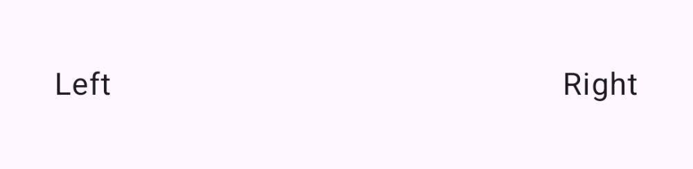

### Surface

Surface is the foundational container behind most Material components. It applies a background color, clips to a shape, and raises content with tonal elevation that tints the surface toward the primary color.

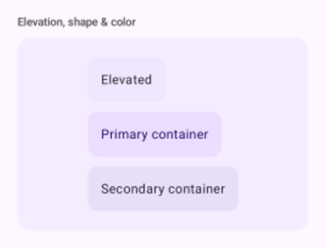

## Lists & Grids

### Lazy Column

LazyColumn lays out and composes only the items that are visible, making it efficient for long or unbounded lists. Pair items with ListItem and HorizontalDivider for a classic settings-style list.

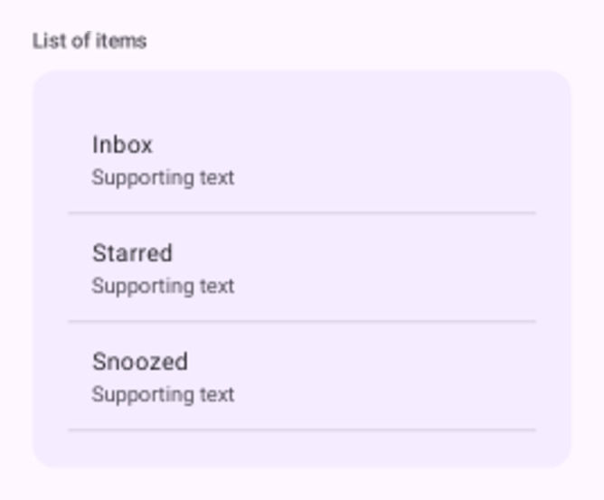

### Lazy Grid

LazyVerticalGrid arranges items into columns described by GridCells. A GridCells.Fixed value pins the column count, while aspectRatio keeps each cell square.

### Lazy Row

LazyRow is the horizontal counterpart to LazyColumn. It is well suited to carousels of cards or thumbnails, with Arrangement.spacedBy adding consistent gaps between items.

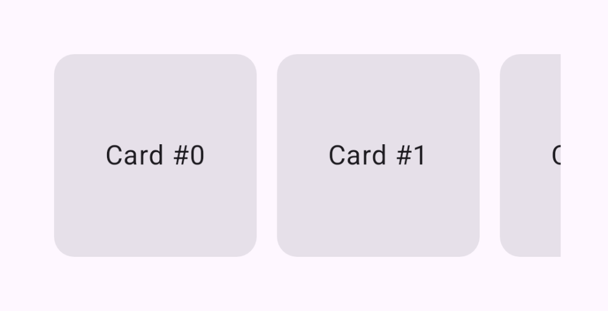

### Pager

HorizontalPager lays out swipeable pages backed by a PagerState. The state exposes currentPage, which can drive indicator dots beneath the pager.

### Staggered Grid

LazyVerticalStaggeredGrid packs items of different heights into columns, creating a masonry layout. StaggeredGridCells.Fixed sets the column count.

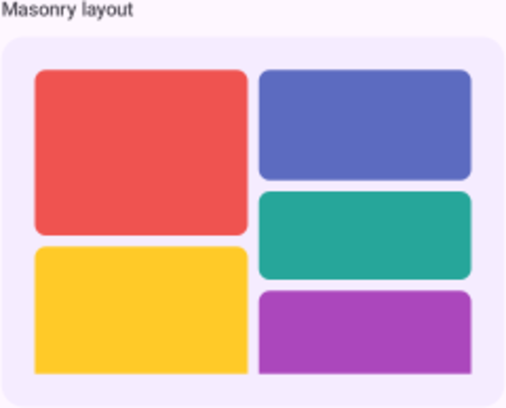

## Animation

### AnimatedContent

AnimatedContent animates the transition whenever its targetState changes, cross-fading (and optionally sliding) between the old and new content. It is well suited to swapping a number, label, or whole layout in response to state.

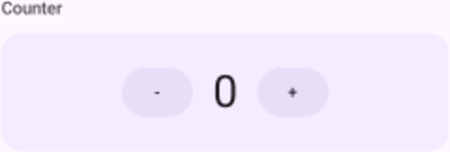

### AnimatedVisibility

AnimatedVisibility animates the appearance and disappearance of its content. Combine enter transitions like fadeIn and expandVertically with matching exits such as fadeOut and shrinkVertically to control how content slides into view.

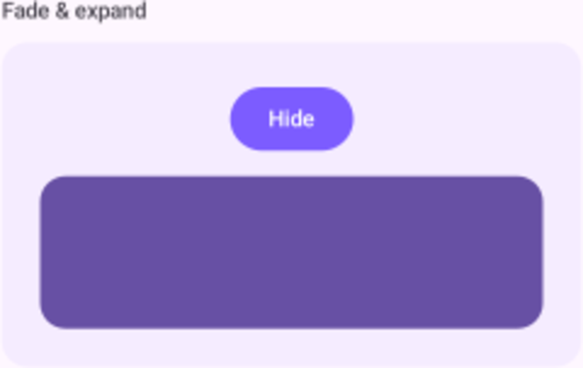

### Crossfade

Crossfade fades between two layouts based on a state value. It is the simplest way to animate a swap between mutually exclusive content, such as paging through a set of cards or switching between loading and loaded states.

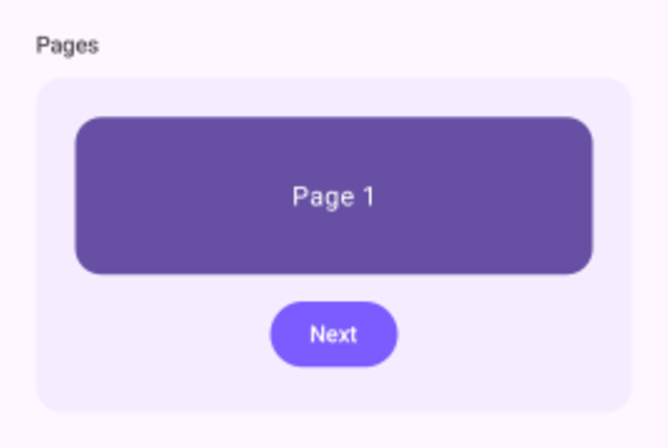

### InfiniteTransition

rememberInfiniteTransition drives one or more values that animate forever. Pair it with infiniteRepeatable and RepeatMode.Reverse to ping-pong a value back and forth — perfect for pulsing, breathing, or shimmering effects.

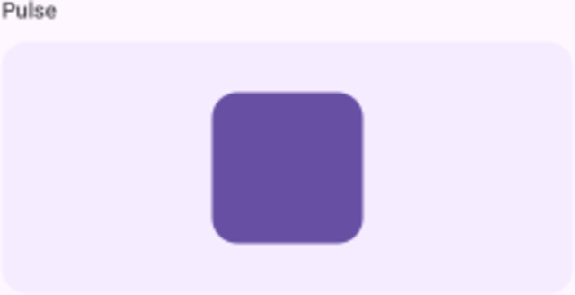

### animate*AsState

The animate*AsState family interpolates a value toward a new target whenever that target changes. Swap in animateColorAsState, animateDpAsState, and friends to drive size, color, offset, or alpha — optionally with a spring for a bouncy feel.

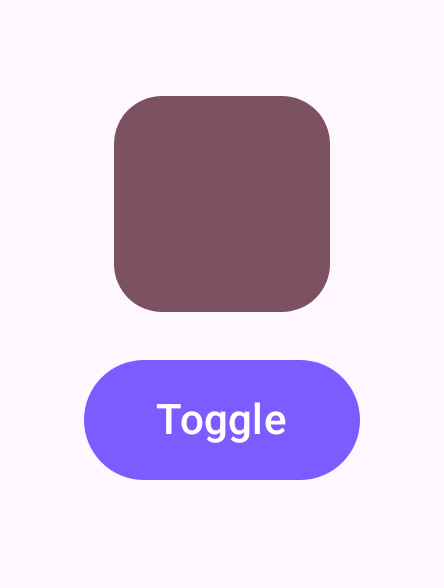

## Gestures & Scroll

### Clickable

Modifier.clickable makes any composable respond to taps. combinedClickable adds long-press and double-tap callbacks, letting a plain Box behave like a button.

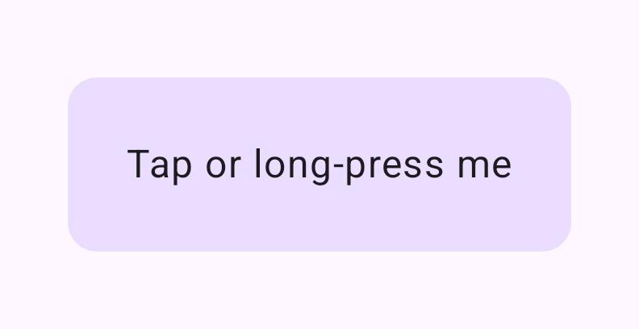

### Draggable

Modifier.draggable reports drag deltas on a single orientation. Track the accumulated offset in state, clamp it to a range, and apply it with Modifier.offset.

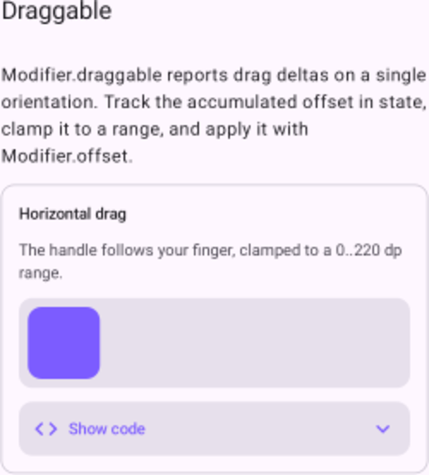

### Pull to Refresh

PullToRefreshBox shows a refresh indicator when the content is pulled past the threshold. Drive it with an isRefreshing flag that you flip off when the work completes.

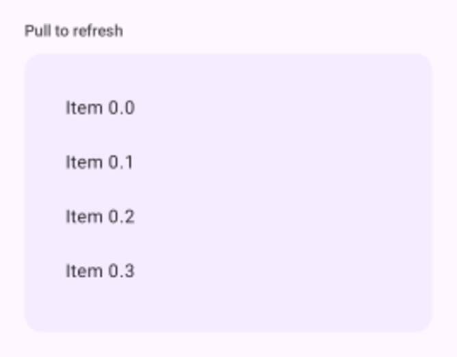

### Scroll

For a known, modest number of items a plain Column made scrollable with Modifier.verticalScroll(rememberScrollState()) is simpler than a lazy list.

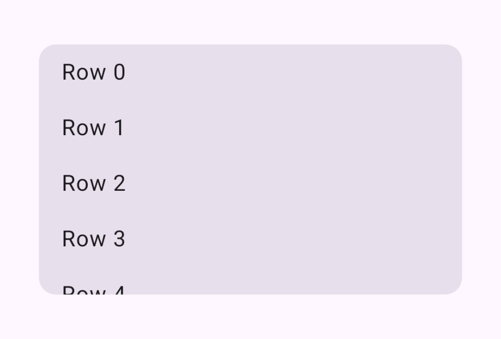

### Swipe to Dismiss

SwipeToDismissBox wraps each row with a swipe gesture and a background that shows behind it. Confirm the dismissal to remove the backing item from the list.

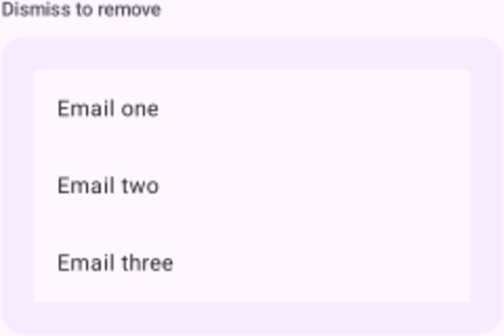

### Transformable

Modifier.transformable feeds combined pan, zoom, and rotation gestures into a single callback. Store the result in state and render it through a graphicsLayer.

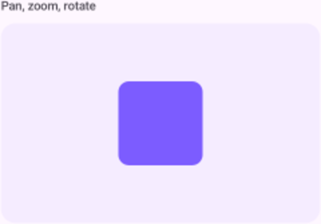

## Graphics & Drawing

### Canvas

Canvas gives you a DrawScope to render custom graphics imperatively. The scope exposes drawLine, drawCircle, drawRect, drawArc, and drawPath, all working in pixels with the composable's own size available as this.size.

### Draw Modifiers

Draw modifiers attach custom rendering to any composable. Modifier.drawBehind paints under the content, Modifier.drawWithContent lets you sequence drawing around drawContent(), and Modifier.border strokes a shaped outline.

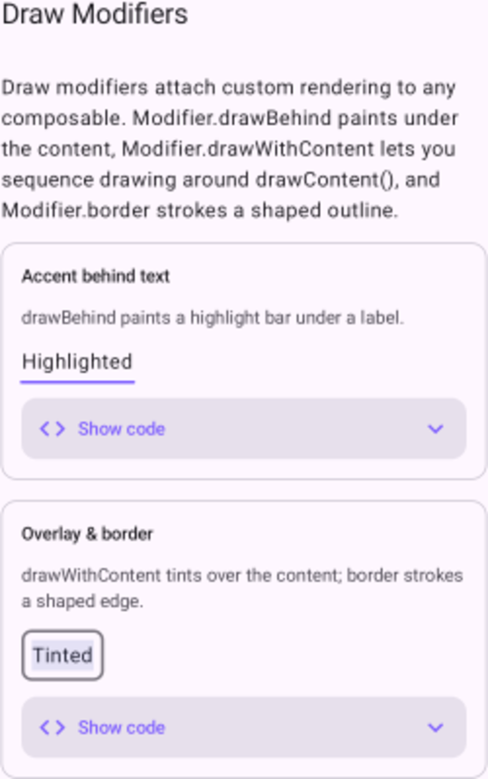

### Gradients

A Brush describes how to paint an area. Brush.linearGradient interpolates along a vector, Brush.radialGradient fans out from a center, and Brush.sweepGradient sweeps around it. Any brush can fill a composable via Modifier.background.

### Shapes & Clipping

Shapes define an outline used for clipping and backgrounds. RoundedCornerShape softens corners, CircleShape produces a pill or circle, and CutCornerShape bevels them. Apply with Modifier.clip then paint with a background.

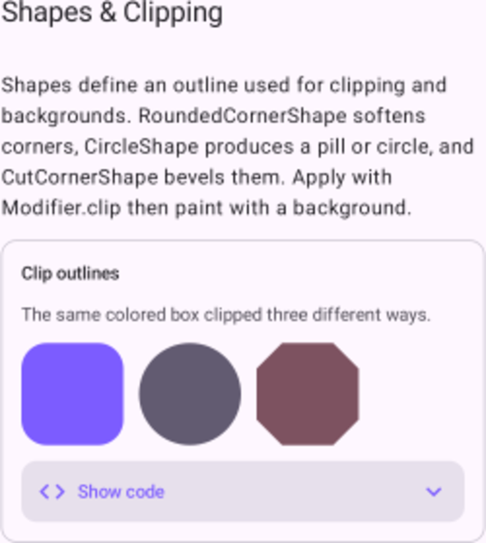

